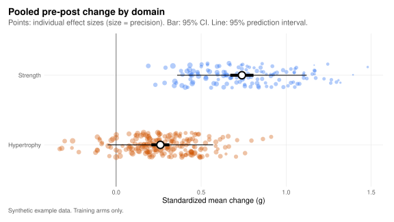
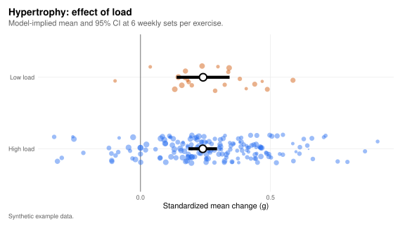
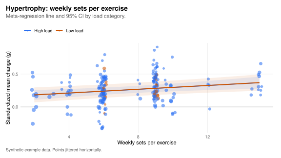
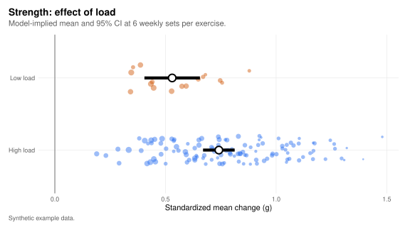
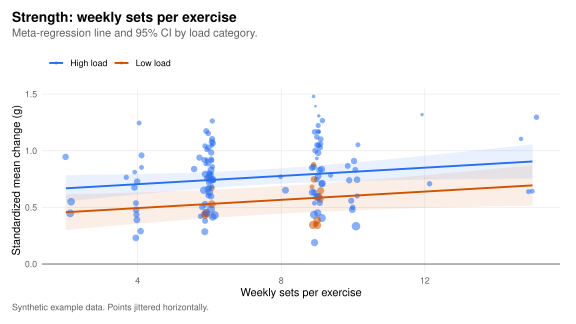

::: {.mf-notice}
Illustration only

These analyses run on synthetic data. They show how the hub's own pipeline turns the tables into results; they are not findings.
:::

## Methods

**Effect sizes.** For every training arm × outcome measure with baseline and post-intervention summary statistics, we computed the standardized mean change: the post minus baseline mean, divided by the baseline SD, with a small-sample correction (metafor's `SMCR`). SDs were derived from SEs where only SEs were reported. The sampling variance requires the pre–post correlation, which studies rarely report, so we assumed *r* = .

**Moderators.** Moderators were derived from the set-level training table over the intervention weeks:

- **Weekly sets per exercise:** total prescribed sets divided by intervention weeks and by the number of distinct exercises.
- **Load:** each set was classified as high load if its prescribed midpoint was at least % 1RM, or a repetition-maximum target of at most RM. An arm was classed as high load when most of its sets were.

**Models.** Separately for each domain, a multilevel random-effects model with effect sizes nested in arms nested in studies (REML, *t*-tests), and a meta-regression adding load category and weekly sets per exercise (centred at ).

## Pooled change

{.mf-inline-svg fig-alt="Pooled standardized mean change for hypertrophy and strength with 95% confidence and prediction intervals, over the individual effect sizes."}



## Hypertrophy

Across  studies ( effect sizes from  arms), the pooled change was *g* = , with a 95% prediction interval of .

- **Load:** the low- vs. high-load difference was  (*p* ).
- **Weekly sets:** each additional weekly set per exercise changed *g* by  (*p* ).

::: {layout-ncol="2"}
{.mf-inline-svg fig-alt="Hypertrophy effect sizes for high- and low-load arms with model-implied means."}

{.mf-inline-svg fig-alt="Hypertrophy effect sizes against weekly sets per exercise with meta-regression lines by load."}
:::

## Strength

Across  studies ( effect sizes from  arms), the pooled change was *g* = , with a 95% prediction interval of .

- **Load:** the low- vs. high-load difference was  (*p* ).
- **Weekly sets:** each additional weekly set per exercise changed *g* by  (*p* ).

::: {layout-ncol="2"}
{.mf-inline-svg fig-alt="Strength effect sizes for high- and low-load arms with model-implied means."}

{.mf-inline-svg fig-alt="Strength effect sizes against weekly sets per exercise with meta-regression lines by load."}
:::

## Meta-regression coefficients



## Limitations of the example

- The data are synthetic; the "effects" were built into the generator and the models simply recover them.
- The pre–post correlation is assumed, not observed. Changing `analysis.pre_post_r` in `config/project.yml` reruns everything that depends on it.
- Weekly sets are counted per exercise, not per muscle group, and the load rule is a deliberately simple two-category split.
